<p align="center">
  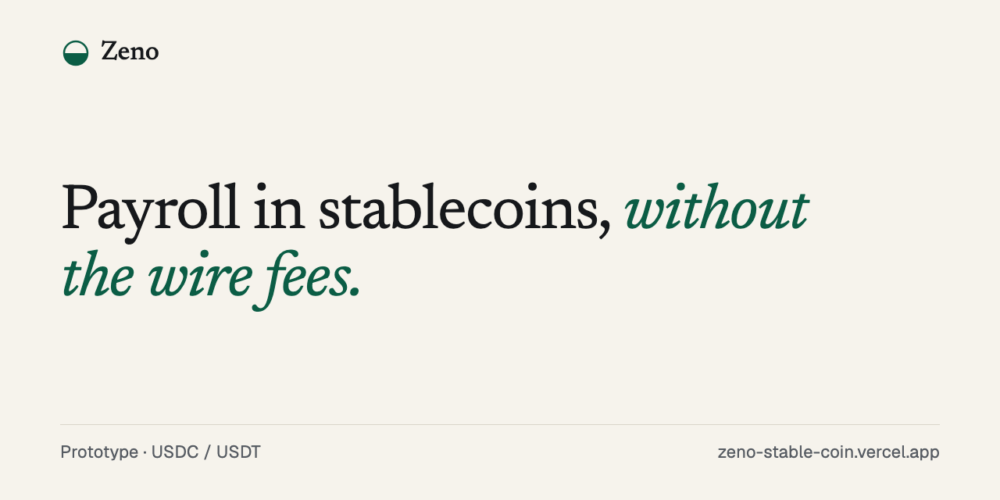
</p>

<p align="center">
  Stablecoin payroll for founders paying contractors across time zones. Fund once, pay in USDC or USDT, and let idle cash earn yield.
</p>

<p align="center">
  <a href="https://github.com/ysta32/ZenoStableCoin/actions/workflows/ci.yml"></a>
  <a href="LICENSE"></a>
  <a href="https://zeno-stable-coin.vercel.app"></a>
</p>

> **This is a front-end prototype.** Everything runs in your browser on mock data from `src/data.ts`. There is no backend, no wallet, no blockchain call, and no real money moves. The API snippet, the SOC 2 claim, and the fee and competitor numbers on the landing page are pitch copy, not working features.

## Screenshots

<p align="center">
  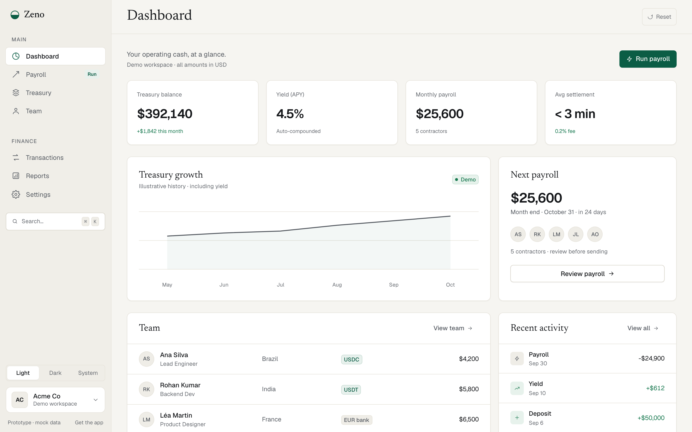
</p>

<table>
  <tr>
    <td>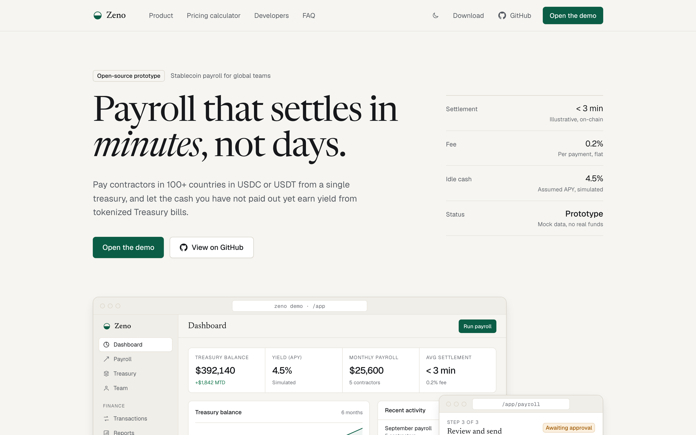</td>
    <td>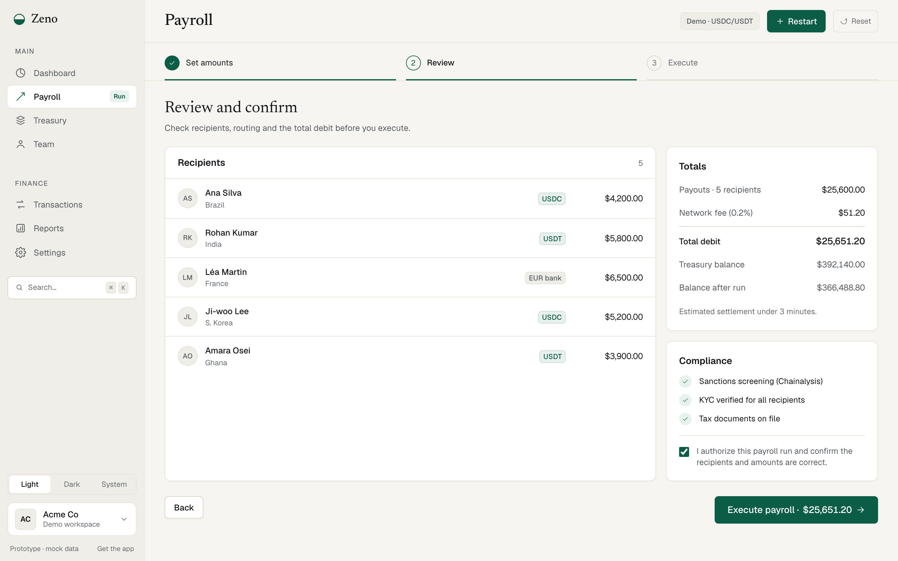</td>
  </tr>
  <tr>
    <td>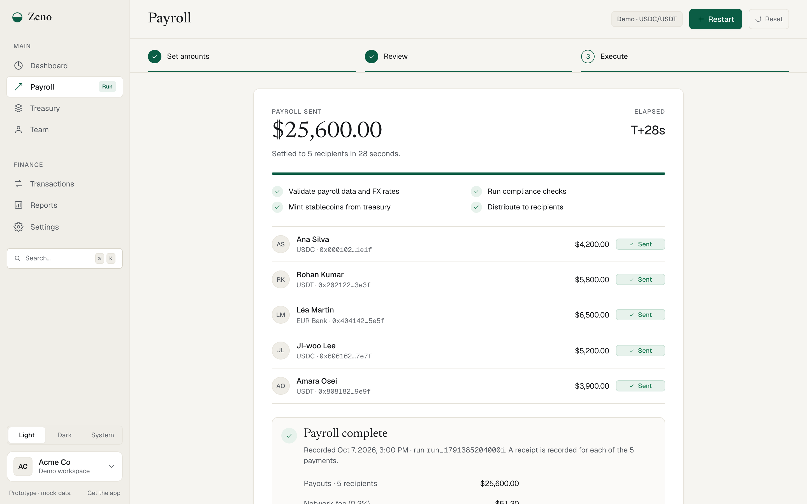</td>
    <td>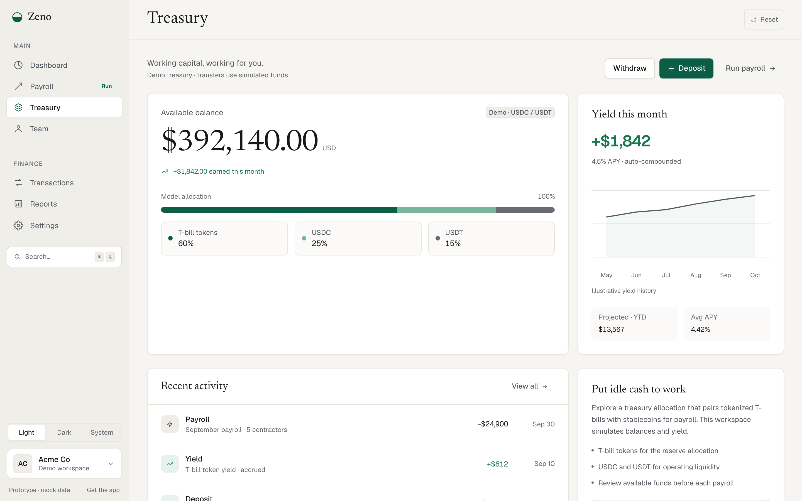</td>
  </tr>
  <tr>
    <td>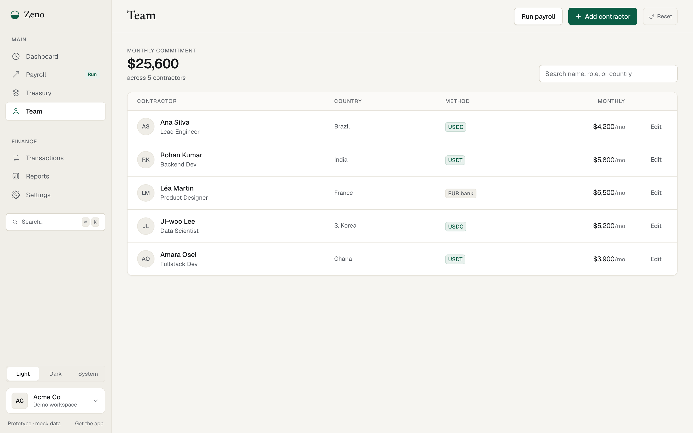</td>
    <td>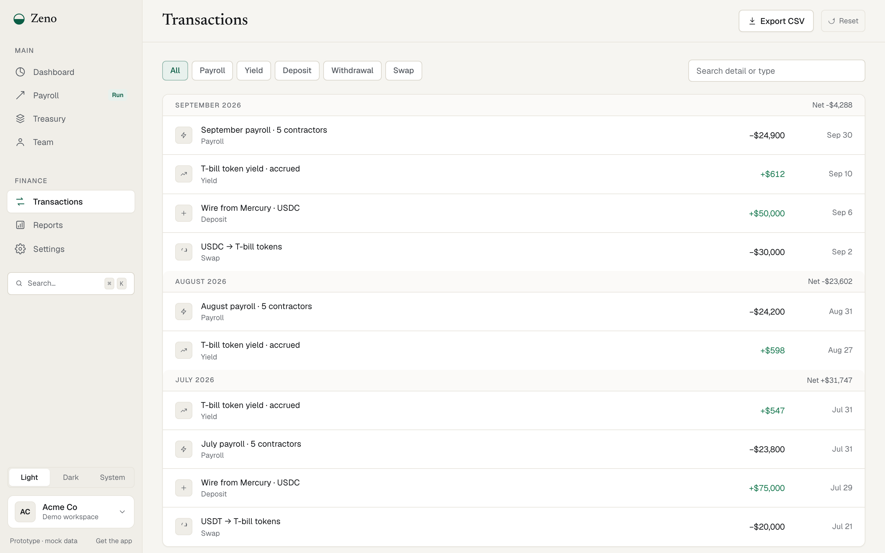</td>
  </tr>
  <tr>
    <td>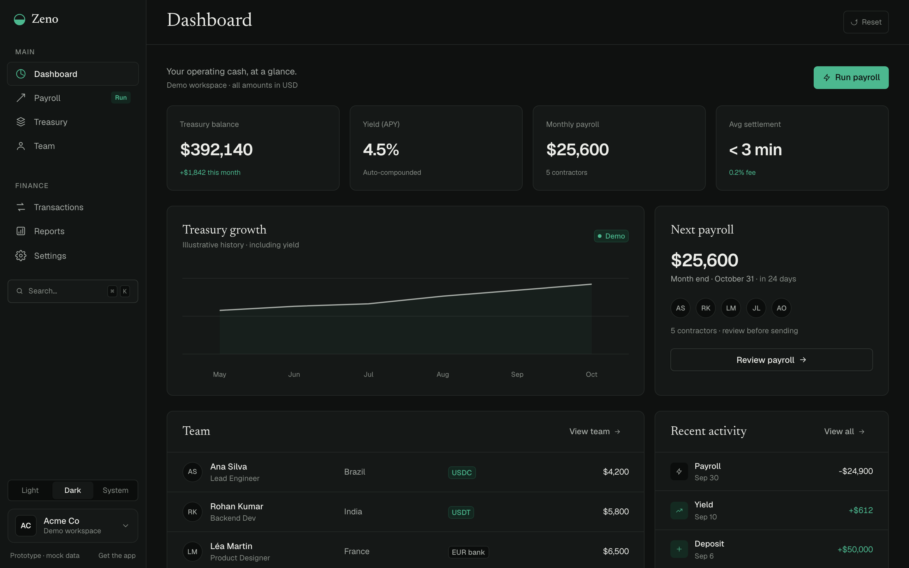</td>
    <td>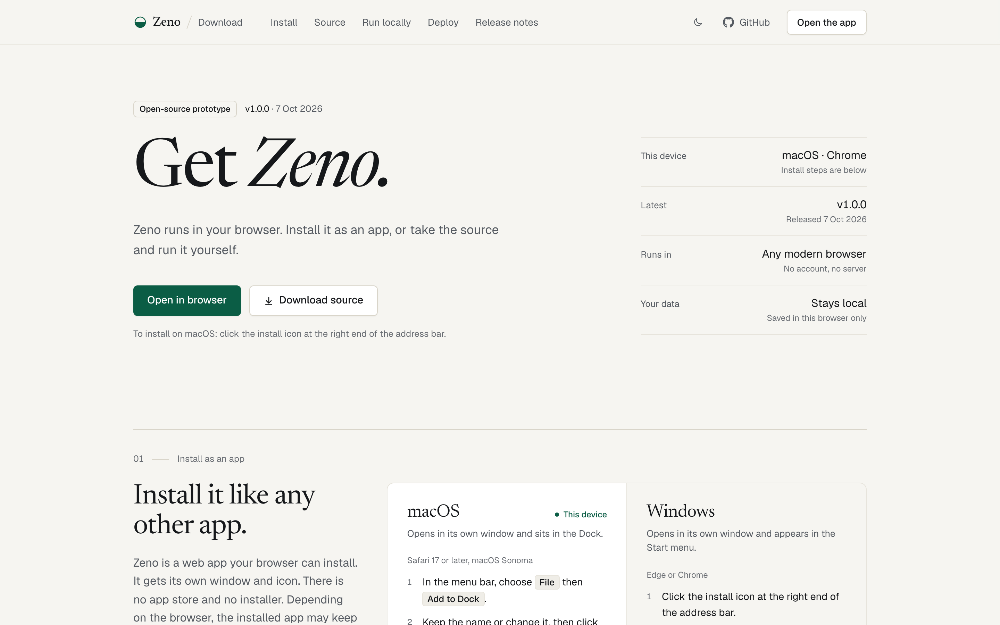</td>
  </tr>
  <tr>
    <td colspan="2" align="center">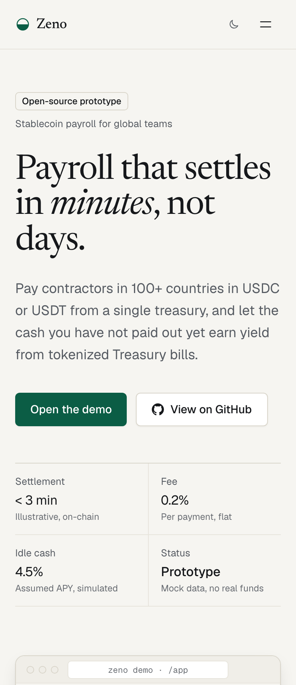</td>
  </tr>
</table>

## Features

- **Landing** (`/`): how it works, a fee calculator, a comparison with Deel, Wise and SWIFT, a sample API call and FAQ.
- **Dashboard** (`/app`): treasury balance, yield, monthly payroll, the next scheduled run and recent activity.
- **Payroll**: set amounts per contractor (or import a CSV; a sample is at `/sample-team.csv`), review simulated checks and authorize, then watch a scripted run mark each person Sent. Amounts are validated to the cent, runs are idempotent, and each run is recorded with a downloadable receipt.
- **Treasury**: balance, yield and allocation. Deposit and Withdraw change the balance.
- **Team, Transactions, Reports, Settings**: transactions and reports export CSV built from the mock data; Settings has "Reset demo".
- **Command palette and shortcuts**: `Ctrl/Cmd+K`, and `g` then a letter to jump between views (`?` shows the cheat sheet).
- **Themes**: light by default, dark or system from the landing nav, sidebar or Settings.
- **State**: team, runs and treasury persist in `localStorage` (`zeno.state.v2`).

### Install as an app

Zeno is an installable PWA with an offline service worker. Open the [live demo](https://zeno-stable-coin.vercel.app/download) (`/download`) for per-platform steps, or use your browser's install option (Chrome and Edge show an install button in the address bar; Safari uses Share, then Add to Dock or Home Screen).

## Quick start

```bash
git clone https://github.com/ysta32/ZenoStableCoin.git
cd ZenoStableCoin
npm install
npm run dev
```

Node 22 is what CI uses.

## Scripts

| Script                            | What it does                                                     |
| --------------------------------- | ---------------------------------------------------------------- |
| `npm run dev`                     | Start the Vite dev server                                        |
| `npm run build`                   | Type-check and build to `dist/`                                  |
| `npm run preview`                 | Serve the production build locally                               |
| `npm run check`                   | Typecheck, lint and unit tests                                   |
| `npm run test`                    | Vitest unit tests                                                |
| `npm run e2e`                     | Playwright end-to-end tests (port from `E2E_PORT`, default 4173) |
| `npm run screenshots`             | Regenerate `docs/screenshots/`                                   |
| `npm run og`                      | Render `public/og-cover.png` and `docs/banner.png`               |
| `npm run lint` / `typecheck`      | ESLint / TypeScript only                                         |
| `npm run format` / `format:check` | Prettier write / check                                           |

## Tech stack

React 18, TypeScript, Vite, Tailwind CSS, Framer Motion. Fonts (Newsreader, Geist, Geist Mono) are self-hosted via Fontsource. Tested with Vitest and Playwright; CI on GitHub Actions; deployed on Vercel.

## Project structure

```
src/
  context/     AppContext: all state, routing and persistence
  views/       Landing, Download, Dashboard, Payroll, Treasury, Team, ...
    landing/   Landing sections
    download/  Download page sections
    payroll/   Payroll steps, ledger rules, history
  components/  Shared UI, shell, dialogs
  lib/         money, csv, fees, install prompt (with unit tests)
  data/        Release notes shown on /download
  data.ts      Mock data
public/        manifest, service worker, icons, sample CSV
e2e/           Playwright smoke and screenshot specs
docs/          ARCHITECTURE.md, DESIGN.md, banner and screenshots
scripts/       icons, screenshots, og image
```

## Architecture

One React context holds state, with a hand-rolled History API router, validated `localStorage` persistence, an idempotent payroll ledger and a precaching service worker. See [docs/ARCHITECTURE.md](docs/ARCHITECTURE.md).

## Design system

"Ledger": a private bank's statement crossed with a well-set editorial page. Tokens, typography and primitives are documented in [docs/DESIGN.md](docs/DESIGN.md).

## Roadmap

Zeno is a prototype, and none of this is built. Possible next steps: a real backend and authentication, wallet and on-chain settlement for USDC and USDT, a compliance and KYC flow, and live yield sourcing.

See [CONTRIBUTING.md](CONTRIBUTING.md) to get involved and [CHANGELOG.md](CHANGELOG.md) for release history.

## License

[MIT](LICENSE) © 2026 Zeno contributors.
